  

  

  

  

*↑ [CrossAudit](https://github.com/dongzhaohe321418-lab/crossaudit_v4) — one model works, a different vendor's model audits, every claim ledgered in Git.*

  

  

`cd` [crossaudit_v4](https://github.com/dongzhaohe321418-lab/crossaudit_v4) · [crossaudit](https://github.com/dongzhaohe321418-lab/crossaudit) · [labscope](https://github.com/dongzhaohe321418-lab/labscope) · [materials-simulation-handbook](https://github.com/dongzhaohe321418-lab/materials-simulation-handbook) · [programming-handbook](https://github.com/dongzhaohe321418-lab/programming-handbook) · [all repos →](https://github.com/dongzhaohe321418-lab?tab=repositories)

  

  

  

`$ echo $MOTTO` → *every number backed by evidence — in science and in software*

