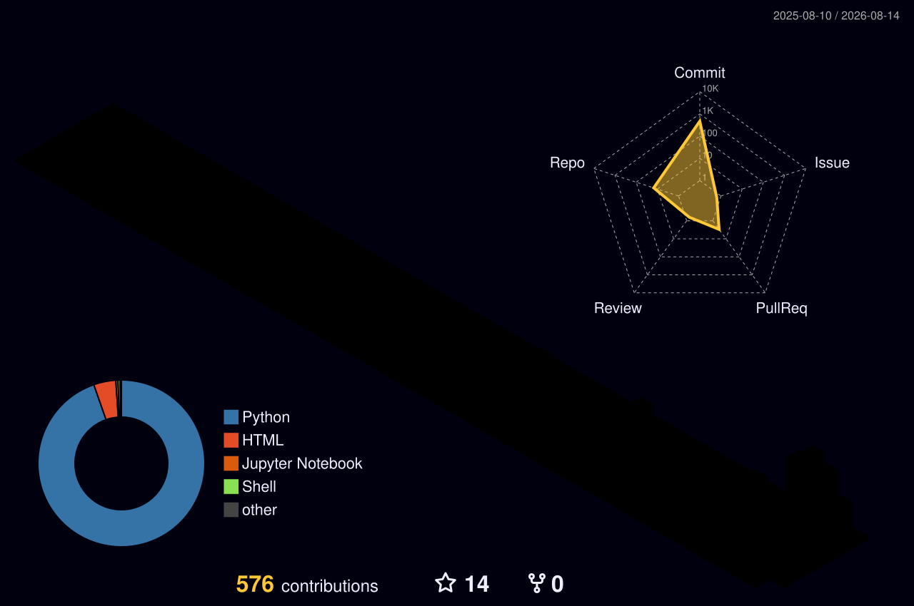

<!-- animated wave header -->

<!-- self-typing intro -->

<!-- custom animated banner -->

  

## 🖥️ What I build, in one terminal session

  

> That's **CrossAudit** — my cross-vendor AI work loop. One model does the work, a *different vendor's* model audits the committed result, and everything is ledgered in Git with cryptographically bound receipts. Fail-closed honesty: never show a number the ledger can't support.

## 🚀 About Me

- 🔬 Undergraduate researcher in **ML/agentic materials science** — perovskites, polymer adsorbents, XRD/NMR decoding
- 🤖 Obsessed with **verifiable AI**: multi-agent systems with built-in independent supervision
- 📖 Writing **open handbooks** that take readers from zero to running code
- ⚡ Philosophy: *reproducibility first, evidence always*

## ⭐ Flagship Projects

  

| | Project | Why it matters |
|---|---------|----------------|
| 🛡️ | **[crossaudit_v4](https://github.com/dongzhaohe321418-lab/crossaudit_v4)** | Cross-vendor AI generate→audit loop. ~61k lines, Python stdlib-first, **620+ tests**, cryptographic receipts. |
| 🔁 | **[crossaudit](https://github.com/dongzhaohe321418-lab/crossaudit)** | Where it began — the original adversarial two-agent, one-replayable-ledger loop. |
| 🔭 | **[labscope](https://github.com/dongzhaohe321418-lab/labscope)** | Instrument-procurement intelligence: gas-analyzer specs backed by real-time literature evidence. |
| 🧪 | **[materials-simulation-handbook](https://github.com/dongzhaohe321418-lab/materials-simulation-handbook)** | Undergraduate-level guide to materials modelling & simulation — DFT to MD. |
| 💻 | **[programming-handbook](https://github.com/dongzhaohe321418-lab/programming-handbook)** | Zero-foundation handbook: bits & binary → data structures & algorithms, Python runnable in the browser. |

<b>🔬 More science & systems…</b>

 

- **[zemax-mcp](https://github.com/dongzhaohe321418-lab/zemax-mcp)** — Ansys Zemax OpticStudio driven by AI agents over MCP; chick/human eye illumination simulations
- **[nmr-ssl](https://github.com/dongzhaohe321418-lab/nmr-ssl)** — sort-match SSL for NMR chemical shift prediction, with causal audit & conformal guarantees
- **[xrd-ssl](https://github.com/dongzhaohe321418-lab/xrd-ssl)** — self-supervised learning for XRD pattern decoding
- **[perovskite-screening](https://github.com/dongzhaohe321418-lab/perovskite-screening)** — ML screening of perovskite compositions with [immutable audit artifacts](https://github.com/dongzhaohe321418-lab/perovskite-screening-audit)
- **[matsci-env](https://github.com/dongzhaohe321418-lab/matsci-env)** — three commands to a full DFT/MLIP/MD stack

## 🛠️ Toolbox

**Scientific stack:** `DFT` · `MLIPs (MACE)` · `Molecular Dynamics` · `Active Learning` · `Self-Supervised Learning` · `MCP`

## 🐍 Contribution Snake

  

## 🏙️ Contributions in 3D

  

## 📊 Stats

  

---

💡 *Every number should be backed by evidence — in science and in software.*

